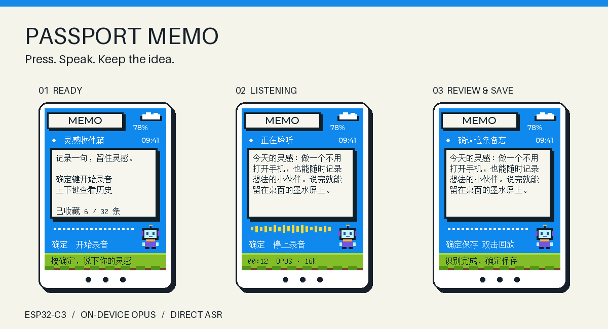
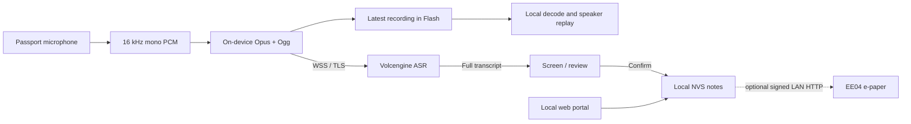

[简体中文](README.zh_CN.md) · **English**

# Passport Memo

**Press. Speak. Keep the idea.**

Turn the FoloToy AI Passport into a pocket voice notebook. Its ESP32-C3 records and encodes audio as **Ogg/Opus**, then connects directly to **Volcengine Doubao streaming ASR** over TLS. No self-hosted ASR relay is required.



*Actual LVGL interface rendered on a computer using sample data; these are not photographs of the device.*

[](https://github.com/netseye/passport-memo/actions/workflows/firmware-checks.yml)
[](https://github.com/netseye/passport-memo/actions/workflows/static-checks.yml)

## What it does

- Live Chinese transcription with a pixel UI, microphone levels, battery status and automatic text wrapping.
- Review before saving, retain an unsaved draft, browse up to **32 notes**, mark notes complete, and delete them from a confirmation menu.
- Double-press OK to replay the latest recording; UP/DOWN changes volume and OK stops. Replay remains available on its saved history note.
- A local web portal for Wi-Fi / ASR setup, note editing, deletion, JSON export and preview/download of the latest saved recording.
- **16 kbps Opus** on the device: roughly **3.4 KB/s Ogg payload**, excluding WebSocket/TLS overhead.
- A top-right Beijing-time clock (UTC+8), with `--:--` before network time is ready.
- Optional signed text synchronization to an **EE04 e-paper display** on the same LAN.

Limits: **120 seconds / 240 Unicode characters per session**. Flash caches only the latest recording for offline playback. Speech recognition requires internet access and an enabled Volcengine resource. The device interface currently uses Simplified Chinese.

## Get started

You need an **AI Passport (ESP32-C3, 8 MB Flash, no PSRAM)**, a USB data cable, 2.4 GHz Wi-Fi and your own Volcengine ASR credentials.

1. [Build and flash](docs/build.md) with **ESP-IDF 5.5.3**. Back up the device first; preserve its protected identity partition.
2. Hold **OK**, join **Passport-Memo** using the eight digits on its screen, and open **http://192.168.4.1**.
3. Enter the same eight digits in the web login. Save router Wi-Fi and ASR credentials. Select the exact resource enabled in your console; **model 1.0 duration** was used in the successful device test.
4. Press **UP** on the device to exit setup. Wait for network readiness, then press **OK** to start.
5. Speak after the listening page appears. Press **OK** to finish, review the text, then press **OK** to save.

[Illustrated setup and button guide](docs/usage.md) · [Troubleshooting](docs/troubleshooting.md) · [EE04 companion](companion/ee04/README.md)

## How it works



The provider's cumulative transcript replaces the previous hypothesis. It is never appended blindly. The display checks for changes every 50 ms and follows the newest text while recording. Final results return to the top for review.

See [architecture and memory budget](docs/architecture.md), [data and security](docs/security.md) and [the documentation index](docs/README.md).

## Project status

**Early working version.** A real Passport completed an approximately 22-second Opus/ASR session and displayed recognized text. Host protocol, Ogg decoding, UI rendering and firmware-layout checks have passed. Original-audio replay has passed build/host checks, reboot cache recovery and short device sessions; listening quality after the volume fix remains to be confirmed.

Long sessions, repeated connection cycles, save/reboot recovery and two-device EE04 synchronization still need physical acceptance. Read the [validation record](docs/validation.md) for exact scope.

## Development

```sh
# Activate ESP-IDF 5.5.3 before the complete gate.
./tools/validate.sh --static
./tools/validate.sh
python3 tests/test_memo_ogg_decode.py  # needs libopus and FFmpeg
```

`main/` contains the application; `components/bsp/` contains the board support; `companion/ee04/` is a separate Arduino program. CI builds firmware and uploads a development artifact. It does not automatically publish a release.

## License and credits

Passport code is **MIT**, derived from [FoloToy/ai-passport](https://github.com/folotoy/ai-passport). The optional EE04 program is **GPL-3.0-only** and is built separately. Memo Pixel 16 / Unifont assets use **SIL OFL 1.1**. Third-party components retain their licenses. See [attributions](docs/attributions.md).

The C3 memory settings were informed by [xiaozhi-esp32](https://github.com/78/xiaozhi-esp32). This is an independent community project, not an official FoloToy or Volcengine product.
