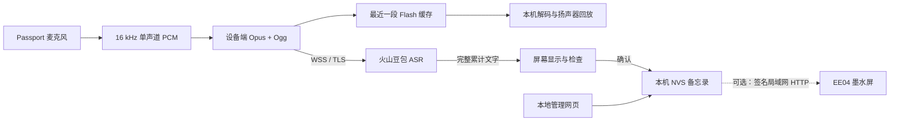

**简体中文** · [English](README.md)

# Passport Memo · 语音备忘录

**按一下，说下来，把灵感留在身边。**

把 FoloToy AI Passport 变成随身语音备忘录。ESP32-C3 在设备上录音、编码为 **Ogg/Opus**，通过 TLS **直接连接火山豆包流式 ASR**，无需自建语音中转服务器。


*图片由真实 LVGL 界面代码在电脑上渲染，使用示例数据；不是设备实拍。*

[](https://github.com/netseye/passport-memo/actions/workflows/firmware-checks.yml)
[](https://github.com/netseye/passport-memo/actions/workflows/static-checks.yml)

## 能做什么

- 边说边显示中文，像素界面、麦克风电平、电量显示与自动换行。
- 识别后先检查再保存，保留未保存草稿，浏览最多 **32 条备忘录**，标记完成。
- 双击确定回放最近一段原声，上 / 下调音量，确定停止；保存后仍可从对应历史回放。
- 本地网页配置 Wi-Fi 和识别服务，也可以编辑、删除记录及导出 JSON。
- 硬件端 **16 kbps Opus** 压缩，当前 **Ogg 负载约 3.4 KB/s**，不含 WebSocket/TLS 开销。
- 可选将确认后的文字签名同步到同一局域网的 **EE04 墨水屏**。

每次最多 **120 秒 / 240 个 Unicode 字符**。Flash 仅缓存最近一段原声，可离线回放；语音识别需要互联网和已开通的火山资源。当前设备界面为简体中文。

## 开始使用

准备 **AI Passport（ESP32-C3、8 MB Flash、无 PSRAM）**、USB 数据线、2.4 GHz Wi-Fi 和自己的火山 ASR 凭据。

1. 按[构建与刷机说明](docs/build.zh_CN.md)使用 **ESP-IDF 5.5.3** 安装。先备份设备，保留受保护的身份分区。
2. 长按 **确定**，用屏幕上的 8 位数字连接 **Passport-Memo** 热点，打开 **http://192.168.4.1**。
3. 网页管理密码填写同一组 8 位数字。保存路由器 Wi-Fi 和火山凭据。资源必须与控制台实际开通的产品一致；本项目成功实测使用的是 **模型 1.0 小时版**。
4. 按设备 **上键**退出设置。等首页提示网络就绪，再按 **确定**。
5. 看到聆听页面后说话，再按 **确定**结束；检查文字后按 **确定**保存。

[图文使用与按键手册](docs/usage.zh_CN.md) · [故障排查](docs/troubleshooting.zh_CN.md) · [EE04 配套固件](companion/ee04/README.zh_CN.md)

## 工作方式



火山返回的累计文字会替换上一版识别结果，避免重复拼接。界面每 50 ms 检查更新，录音中跟随最新文字；识别结束后回到顶部供检查。

详见[架构与内存预算](docs/architecture.zh_CN.md)、[数据与安全](docs/security.zh_CN.md)及[文档目录](docs/README.zh_CN.md)。

## 当前状态

**早期可用版本。** 已在真实 Passport 上完成约 22 秒 Opus/ASR 识别，设备成功显示文字。协议、Ogg 解码、界面渲染和固件布局检查已通过。新增原声回放已通过构建、主机校验、重启缓存恢复和短会话实测；音量修复后的听感仍待确认。

长录音、反复连接、保存后重启恢复以及 Passport 与 EE04 的双机同步仍待实机验收。完整范围见[验证记录](docs/validation.zh_CN.md)。

## 开发

```sh
# 完整检查前先激活 ESP-IDF 5.5.3。
./tools/validate.sh --static
./tools/validate.sh
python3 tests/test_memo_ogg_decode.py  # 需要 libopus 和 FFmpeg
```

`main/` 是应用，`components/bsp/` 是板级支持，`companion/ee04/` 是独立 Arduino 程序。CI 自动编译并上传开发固件产物，不会自动发布正式 Release。

## 许可证与致谢

Passport 代码采用 **MIT**，基于 [FoloToy/ai-passport](https://github.com/folotoy/ai-passport)。独立构建的 EE04 配套程序采用 **GPL-3.0-only**。Memo Pixel 16 / Unifont 字体采用 **SIL OFL 1.1**。第三方组件保留各自许可证，详见[来源与许可](docs/attributions.zh_CN.md)。

C3 内存设置参考了 [xiaozhi-esp32](https://github.com/78/xiaozhi-esp32)。本项目为独立社区项目，并非 FoloToy 或火山引擎官方产品。
