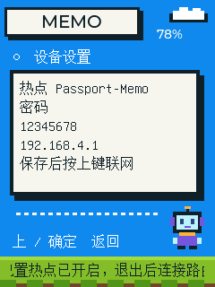
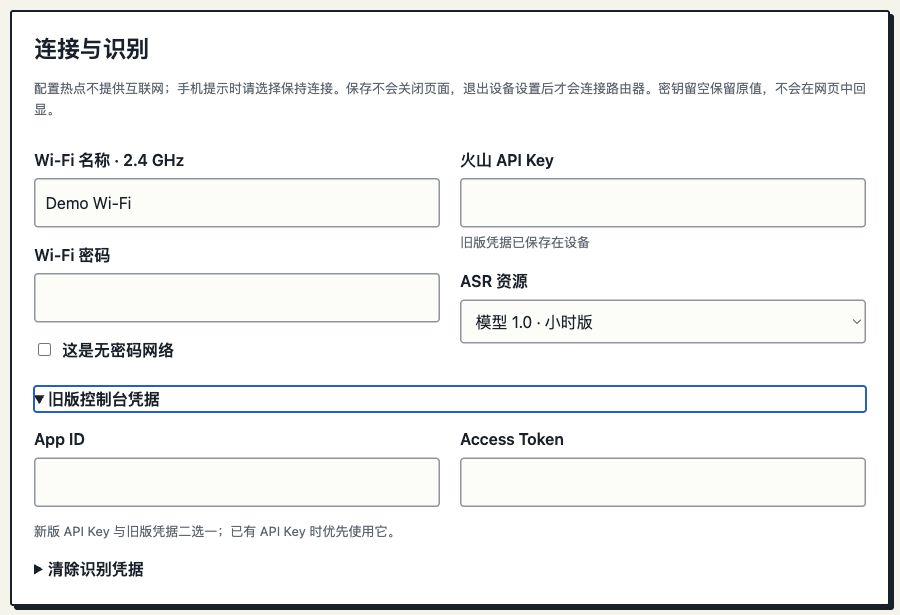
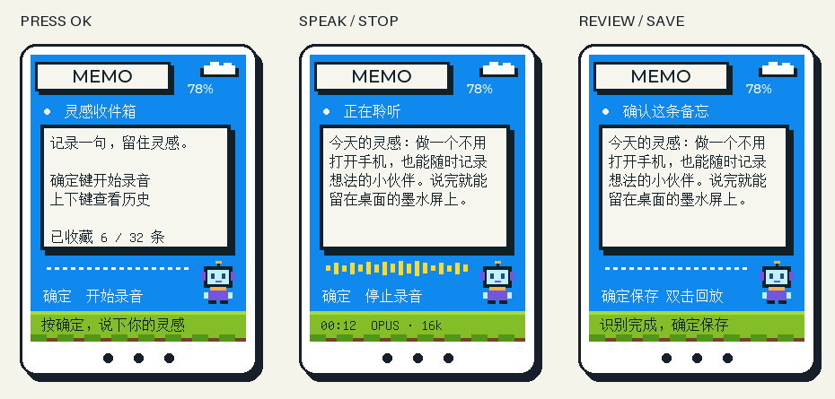
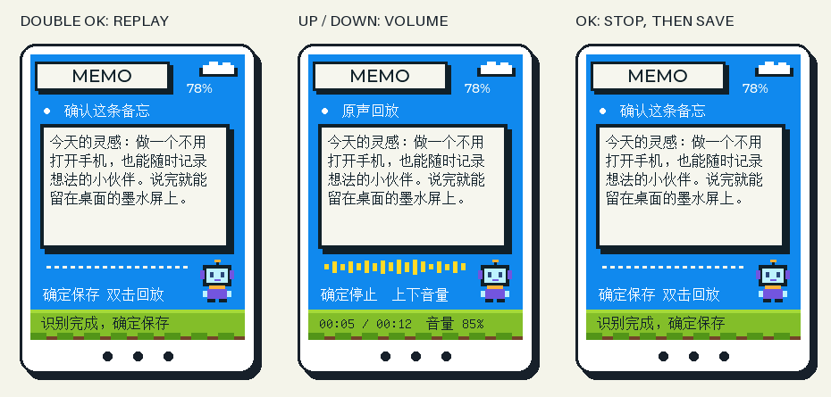

[简体中文](usage.zh_CN.md) · **English**

# Illustrated usage

## 1. Open setup

Hold **OK** for about 1.5 seconds. Setup opens for ten minutes. Join **Passport-Memo** with the eight-digit code shown on the screen, including leading zeros. Open **http://192.168.4.1** manually and use the same code to log in.

*Host-rendered device UI. The pictured code is an example; use your device's current code.*

The phone may warn that this Wi-Fi has no internet. Choose to stay connected. There is no captive-portal popup. Router Wi-Fi is paused during setup. Reopening setup keeps the code for the current boot; rebooting generates a new one.

## 2. Configure Wi-Fi and ASR

Open **Device settings** in the portal. Enter your router's 2.4 GHz SSID and password. Choose either a new API Key or the legacy App ID + Access Token under the expandable legacy-credentials section. An existing API Key takes priority.

*Browser screenshot of the actual portal served with a local demonstration fixture; no real credentials or device data.*

Select the product actually enabled in your Volcengine console:

| Portal option | Resource ID |
| --- | --- |
| Model 1.0 duration | `volc.bigasr.sauc.duration` |
| Model 2.0 duration | `volc.seedasr.sauc.duration` |
| Model 1.0 concurrency | `volc.bigasr.sauc.concurrent` |
| Model 2.0 concurrency | `volc.seedasr.sauc.concurrent` |

The real-device test used **model 1.0 duration** and legacy credentials. Selecting another option does not enable or purchase it in your account. Refer to the [provider documentation](https://docs.volcengine.com/docs/6561/1354869?lang=zh) for service setup.

Blank secret fields preserve saved values. To change from API Key to legacy authentication, explicitly clear the saved credentials, save, then enter the legacy pair and save again. This avoids retaining a higher-priority API Key.

Saving keeps the portal open. Press **UP** or **OK** on the device to exit setup and connect to the router. The phone losing the hotspot at this point is expected. Watch the device's Home footer until Wi-Fi and time synchronization are ready.

## 3. Record, review, save

*Host-rendered screens with sample text.*

Press **OK**, wait for the listening page, then speak. Press **OK** again to stop and wait for the final result. UP/DOWN scrolls the review text. Press OK once more to save.

While speaking, the text may revise earlier words or punctuation. Full results replace the preceding text and follow the bottom of the page. Review starts at the top. This is speech transcription; there is no additional LLM rewriting or summary.

## 4. Replay the original recording

*Actual UI rendered on the host with sample text.*

After recording, **double-press OK quickly** on the review page to replay. During playback, **UP/DOWN** adjusts volume in 5% steps and **OK** stops. Playback returns to the previous page; press OK once to save the text. The screen shows progress, volume and audio levels. The sound-feedback setting controls cues, not replay.

Only the **latest recording**, up to 120 seconds, is retained. Its saved history note displays a double-press replay hint. Text edits leave the original audio intact. Playback works offline and a completed cache survives reboot. Starting the next recording clears the previous audio, even if connecting subsequently fails. Deleting its note also clears the cache. Older notes retain text only, and JSON export excludes audio. If audio was captured without recognized text, double-press OK on the error page to listen.

## 5. Read and organize notes

Home UP/DOWN opens history. In history, UP/DOWN selects another note; long text scrolls by 72 pixels every 4.5 seconds. OK toggles completion. Hold UP to return Home.

The web portal edits, deletes and exports notes as JSON. JSON import is not implemented. A full 32-note history requires deleting an old note; it never silently evicts one.

## Button reference

| Page | UP / DOWN | OK | Hold UP | Hold DOWN | Hold OK |
| --- | --- | --- | --- | --- | --- |
| Home | Open history | Start | Restore draft | — | Settings |
| Connecting / recording / finishing | — | Stop | — | — | Cancel, retaining recognized text |
| Review / error | Scroll text | Save nonempty text | Home; retain draft | — | Settings |
| History | Previous / next | Toggle completed | Home | Retry EE04 sync | Settings |
| Playback | Volume ±5% | Stop playback | — | — | Stop playback |
| Settings | UP exits | Exit | — | — | Extend setup window |

## Storage and limits

Each session is limited to 120 seconds or 240 Unicode code points, whichever is reached first. Finalized sessions with text retain one unsaved draft in Flash. Hold UP from Home or reboot to recover it. A newer nonempty draft replaces the earlier one. Sudden power loss during active recording can lose that session, because the draft and valid audio-cache metadata are committed at session completion. Incomplete caches are not replayed.

The font covers GB2312 and selected punctuation (7,687 glyphs). Other valid Unicode is preserved in storage/export but may display as a missing glyph. Idle backlight dims after one minute; button activity restores it. Battery display depends on an available gauge.
